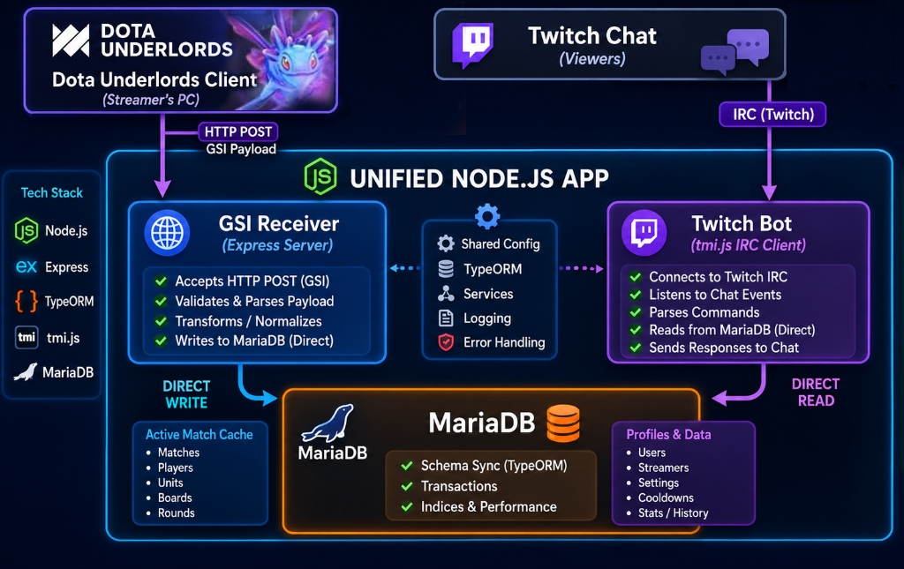

# Consolidated Standalone Dota Underlords GSI Twitch Bot

This project is a high-performance, consolidated, standalone version of the **Fortify Dota Underlords Data Platform**. It integrates the Game State Integration (GSI) telemetry receiver and the Twitch Bot (`17kmmrbot`) into a **single, lightweight Node.js application**.

For the full architecture overview, cPanel deployment guide, and multi-tenant streamer setup, see [Docs/HOSTING.md](Docs/HOSTING.md).



---

## Quickstart / TL;DR (Windows Setup)

If you are on Windows, you can get the bot up and running in a few steps.

### Step 1: Open Terminal and Navigate to Project Folder

Open your terminal (PowerShell or Command Prompt) and change to the folder where you downloaded or extracted the bot files:

If using PowerShell:

```powershell
cd D:\path\to\19kmmrbot
```

If using Command Prompt (CMD):

```cmd
cd /d D:\path\to\19kmmrbot
```

### Step 2: Run the Bootstrapper

Once you are inside the project folder, run the bootstrapper script:

```powershell
powershell ./start.ps1
```

This automatically installs and configures Node.js, MariaDB Server, registers the Windows service, starts the database engine, and compiles the application.

### Step 3: Configure Twitch Credentials

1. Open the newly created `.env` file in the project directory using Notepad or any text editor.
2. Edit `BOT_USERNAME` (your channel name) and `TWITCH_OAUTH_TOKEN` (retrieve one from [twitchtokengenerator.com](https://twitchtokengenerator.com)).
3. Re-run `powershell ./start.ps1` to launch the bot.

### Step 4: Configure the Gamer PC

Place a Game State Integration (GSI) config file in your Dota Underlords game directory so the game client sends match telemetry to your local bot.

- Navigate to your Dota Underlords configuration folder. A typical path is:
  ```
  c:\SteamLibrary\steamapps\common\Underlords\game\dac\cfg\gamestate_integration\
  ```
  **Note:** The `gamestate_integration` folder probably does not exist yet. If it is not there, create it manually inside the `cfg` directory.
- Create a file named `gamestate_integration_fortify.cfg` inside that folder.
- Open the file in a text editor and enter the following:

  ```txt
  "Fortify Dota Underlords GSI Configuration"
  {
      "uri"           "http://127.0.0.1:6666/gsi"
      "timeout"       "5.0"
      "buffer"        "0.1"
      "throttle"      "0.5"
      "heartbeat"     "0.1"
      "auth"          "yourTwitchName"
      "data"
      {
          "provider"      "1"
          "player"        "1"
          "board"         "1"
          "shop"          "1"
      }
  }
  ```

  * **`uri`:** Points to your local bot. The default port is `6666` (set by `PORT` in your `.env` file).
  * **`auth`:** Replace `yourTwitchName` with your exact Twitch username in lowercase. This must match the `BOT_USERNAME` value in your `.env` file.

- Launch Dota Underlords. The game client will automatically broadcast telemetry to your local bot, enabling it to reply to `!mmr` commands in your Twitch chat.

For remote/cPanel deployment and multi-streamer configuration, see [Docs/HOSTING.md](Docs/HOSTING.md).
